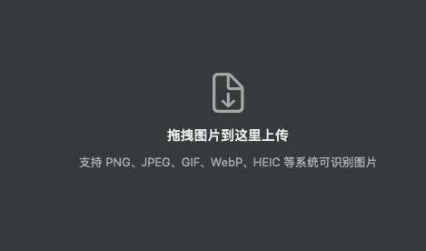

# ImageHoster

中文 | [English](README_EN.md)

ImageHoster 是一个 macOS 图床工具。配置对象存储后，可以通过拖拽或选择图片上传，并快速复制普通链接或 Markdown 图片链接。



## 功能

- 支持阿里云 OSS、腾讯云 COS、七牛云 Kodo。
- 支持拖拽上传、点击上传区域选择图片。
- 上传后显示普通链接和 Markdown 链接。
- 支持单独复制链接，也支持一次复制两种链接。
- 每个服务商独立保存配置，切换服务商不会串配置。
- AccessKey / SecretKey 保存到 macOS Keychain。

## 系统要求

- macOS 11.0 Big Sur 及以上。
- 当前打包脚本面向 Apple Silicon / arm64。

## 配置

需要填写：

- 服务商
- AccessKey / SecretId
- SecretKey
- 容器名称（Bucket / 空间名称）
- 地区
- Endpoint
- 公开域名
- 上传目录

说明：

- 腾讯云 COS 的容器名称通常包含 AppId，例如 `my-bucket-1250000000`。
- 七牛云 Kodo 需要填写公开 CDN 域名。
- 未点击“保存配置”的内容不会持久化。

## 使用

1. 选择服务商并填写配置。
2. 点击“保存配置”。
3. 点击上传区域选择图片，或直接拖拽图片到上传区域。
4. 上传成功后，在上传记录中复制链接。

## 开发运行

```bash
swift run ImageHoster
```

## 编译

```bash
swift build --scratch-path /tmp/imagehoster-build
```

## 打包 App

```bash
./Scripts/package-app.sh
```

输出：

```text
dist/ImageHoster.app
```

## 生成 Release 包

```bash
./Scripts/release.sh 1.0.0
```

输出：

```text
release/ImageHoster-v1.0.0-macos-arm64.zip
```

校验：

```bash
unzip -l release/ImageHoster-v1.0.0-macos-arm64.zip
```

GitHub Release 示例：

```bash
gh release create v1.0.0 \
  release/ImageHoster-v1.0.0-macos-arm64.zip \
  --title "ImageHoster v1.0.0" \
  --notes-file RELEASE_NOTES.md
```

## 数据与隐私

- Release 包只包含 `ImageHoster.app`。
- 不包含 Keychain 数据、UserDefaults 配置、上传历史、缓存、`.DS_Store` 或构建目录。
- 脚本不会删除你本机已经保存的配置和密钥。
